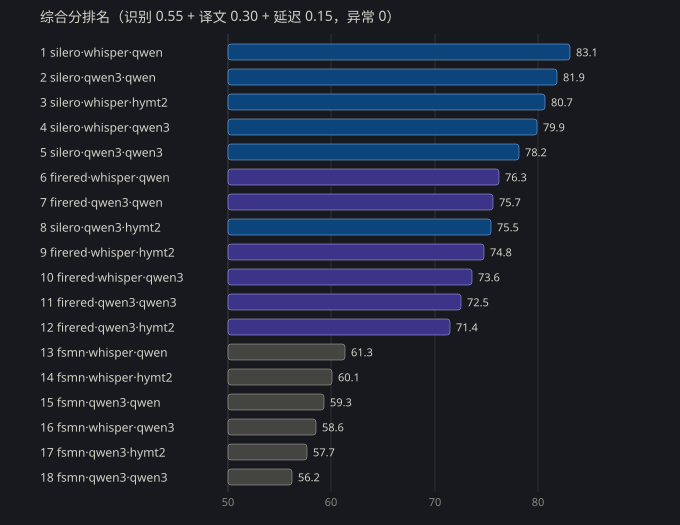
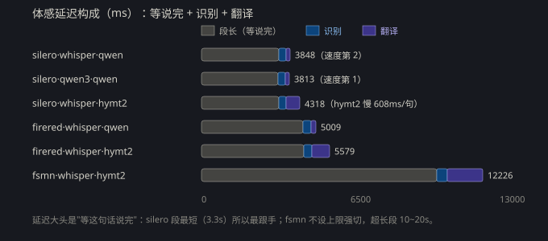

# MaiSubtitle

Windows 上的实时字幕翻译。捕获系统正在播放的声音，分句后识别，译成中文，显示成悬浮字幕。

- 识别英语 / 日语 / 韩语 / 中文
- 本地推理
- 转换模式：视频文件 → 双语字幕（SRT / ASS）

## 安装

要求：Windows 10/11 64 位，NVIDIA 显卡（建议 6GB 显存以上），约 9GB 磁盘空间（再装可选模型约 13GB）。

1. 双击 `安装_首次使用.bat`。它负责建环境、装依赖、下模型、导出 VAD、自检；重复运行不会重复下载。
2. 装完双击 `启动_MaiSubtitle.bat`。

下载内容：Whisper large-v3-turbo（识别，1.5GB）、Hy-MT2-1.8B（翻译，3.9GB）、FireRedVAD（分句）、
标点模型（中文补标点，0.3GB），加上依赖（含 PyTorch，约 3GB），合计约 8GB。只看缺什么不下载：`安装_首次使用.bat --check`。

依赖和模型先测速再选源（PyPI：清华 / 中科大 / 腾讯云 / 阿里云；模型：HF 镜像 / ModelScope）。
要指定 PyPI 源：`安装_首次使用.bat --mirror 清华`。

<details>
<summary>手动安装（不用 bat 的话）</summary>

```
# 源用清华（实测最快）。别用默认源：同一只 torch wheel 实测 0.2MB/s vs 24MB/s，2.5GB 差 3 小时
set M=https://pypi.tuna.tsinghua.edu.cn/simple/
uv venv --python 3.12 --seed .venv   # --seed 顺带装 pip（uv 建的 venv 默认没有）；没装 uv 就用 python -m venv .venv
.venv\Scripts\python.exe -m pip install -r requirements.txt -i %M%
.venv\Scripts\python.exe -m pip install --no-deps faster-whisper==1.2.1 -i %M%
.venv\Scripts\python.exe -m pip install --no-deps funasr-onnx==0.4.3 jieba -i %M%
.venv\Scripts\python.exe scripts/download_models.py --only whisper_turbo silero_vad firered hymt2
.venv\Scripts\python.exe scripts/model_manager.py export firered
```

后两条 `--no-deps` 不能省也不能并进上一条：`faster-whisper` 会顺带装 CPU 版 onnxruntime
把 `onnxruntime-gpu` 覆盖掉，`funasr-onnx` 则声明了与本项目冲突的 numpy 版本。
原因写在 `requirements.txt` 末尾。用 uv 建的 venv 没有 pip 时，把 `.venv\Scripts\python.exe -m pip install`
换成 `uv pip install --python .venv\Scripts\python.exe`、`-i` 换成 `--index-url`。
</details>

四个启动器：

| 文件 | 用途 |
|---|---|
| `安装_首次使用.bat` | 首次安装/环境损坏使用 |
| `启动_MaiSubtitle.bat` | 日常启动。无窗口，崩溃或卡死会自动重启 |
| `启动_MaiSubtitle_控制台.bat` | 带控制台，排错 |
| `启动_MaiSubtitle_调试.bat` | 调试模式，卡死 15 秒转储线程栈 |

缺依赖或模型时，启动器会停下来列出缺什么和对应的补救命令。

## 默认配置

默认值即推荐值，装完直接用。

| 项 | 默认 |
|---|---|
| 识别 / 翻译 / 分句 | Whisper large-v3-turbo / Hy-MT2-1.8B / FireRedVAD |
| 单句上限 / 断句静音 | 7 秒 / 500 毫秒 |
| 显示 | 实时出字，原文先上屏，每句停留 2 秒，历史 2 行 |
| 音乐过滤 | 15% |

延迟约等于段长加 0.7 秒，所以单句上限是最大的旋钮。想更快就在设置 → 分句里点「低延迟预设」，上限调到 4 秒。

## 引擎

识别（设置 → 识别引擎）：

| 选项 | 说明 |
|---|---|
| Whisper large-v3-turbo | 默认。本地 GPU，能自动判断语种 |
| Qwen3-ASR-0.6B | 本地 ONNX，省显存。不判语种，需要固定源语言 |
| HTTP 服务 | 转发到 `/v1/audio/transcriptions`，兼容 vLLM、qwen-asr-serve、FunASR |
| 火山引擎流式识别 | 云端 WebSocket，识别与标点由云端给。音频会上传云端并按量计费 |

火山需要填密钥：新版控制台填 API Key，旧版填 App Key 加 Access Key。资源 ID 要和开通的服务对应，1.0 是 `volc.bigasr.sauc.duration`，2.0 是 `volc.seedasr.sauc.duration`。填完点「验证连接」会真连一次，失败会给出 logid。它和 Qwen3-ASR 一样不判语种，记得固定源语言。

翻译（设置 → 翻译引擎）：

| 选项 | 模型 | 速度 |
|---|---|---|
| qwen | Qwen2.5-1.5B-CT2 | 最快，约 0.22 秒每句 |
| qwen3 | Qwen3-1.7B-CT2 | 约 0.37 秒每句 |
| hymt2 | 混元 Hy-MT2-1.8B | 约 1.3 秒每句，默认引擎；需要 CUDA 版 torch，没有就换成 qwen |

引擎都不可用时只显示原文。

分句（设置 → VAD 引擎）：`firered` 默认，切句最整；`fsmn` 备选；`silero` 切得最碎，但依赖最少。

## 用法

字幕窗三行：历史行（灰字）、当前原文、当前译文（大字）。右下角转圈表示正在识别。

| 快捷键 | 功能 | 快捷键 | 功能 |
|---|---|---|---|
| F9 | 显示 / 隐藏字幕窗 | F5 | 源语言（auto / en / ja / ko / zh） |
| F10 | 鼠标点击穿透 | F7 | 切换显示器 |
| F11 | 双语 / 仅译文 / 仅原文 | F8 | 术语库编辑器 |
| F12 | 暂停识别 | F6 | 导出本次会话字幕 |

Esc 没有绑定功能，退出用托盘菜单。

术语库用于提高人名和专有名词的准确率，**默认关闭**。要用的两种方式：按 F8 打开编辑器（保存过就自动启用），或在「设置 → 术语与质量」里填文件路径。样例见仓库里的 `glossary.example.csv`。

在设置里选了没装的模型，窗口底部会出现「下载缺失的模型」按钮，点了弹一个命令窗口下载，走镜像、可断点续传。

不知道选哪套模型：设置 → 识别与翻译 → 部署跑分。跑一遍 3 种分句 × 2 种识别 × 3 种翻译的
全部组合（4 语种切片，只测本机已装的模型），命令窗口里直接给排名和推荐。约 15~25 分钟，
GPU 跑满。

## 跑分参考（开发机实测）

跑分机器：RTX 4060 Laptop 8GB，i7-13700H，32GB 内存，Windows 11。
切片：英语（BBC 播客 60s）、日语（TTS 43s）、韩语（游戏解说 60s）、中文（TTS 18s）。



- 最优搭配 silero + whisper + qwen（综合 83.1）；最快 silero + qwen3-asr + qwen（体感 3.8s）。
- 延迟的大头是等一句话说完（段长），识别本身只占 0.2~0.4s/段。
- 翻译：qwen 约 0.16s/句；hymt2 质量打分最高但约 0.6~0.8s/句。



在自己的机器上跑一遍再对照（本机结果在 `docs/bench_dev.json`）：

```
.venv\Scripts\python.exe scripts/bench_deploy.py
```

配置文件是 `config.json`，由程序自己读写，删掉会按默认值重建。里面会存火山 API Key，所以没有进版本库。

## 常见问题

| 现象 | 处理 |
|---|---|
| 双击启动器没反应 | 先用 `启动_MaiSubtitle_控制台.bat` 看报错，或跑 `安装_首次使用.bat --check`。日志在 `logs/` |
| 一直不出字幕 | 确认有声音在放、没按 F12。看 `logs/live_demo.log` 里的统计是否在涨；出现音乐段过滤告警就把音乐过滤调到 10~20% |
| 延迟大 | 设置 → 分句 → 低延迟预设 |
| 中文视频没有译文 | 中文不翻译；F5 切到 zh 时只出原文，这是预期行为 |
| 缺模型 | `安装_首次使用.bat --check` 会列出缺什么以及对应命令 |
| 下载模型失败 | 报错会写 `[fail] 项名（缺 哪个文件）`。脚本按 HF 镜像 → 官方源 → ModelScope 镜像依次试；都不通就按提示把权重手动放进 `models/` 里对应目录 |
| 卡住或闪退 | 已知问题，守护进程会在心跳超时 25 秒后自动重启 |
| 译文出得很慢 | torch 多半是 CPU 版（PyPI 的 Windows 轮子默认如此）。设置里把翻译引擎换成 `qwen`（约 0.22 秒每句，不需要 torch）；要用 hymt2 就装 CUDA 版 torch |
| 分句比预期碎 | 多半缺 FireRedVAD，自动改用了 Silero：重跑 `安装_首次使用.bat --skip-models` 把它补上 |

## 其它

离线转写视频：

```
.venv\Scripts\python.exe scripts/file_translate.py 视频.mp4
.venv\Scripts\python.exe scripts/file_translate.py 视频.mp4 --src ja
```

模型与显卡工具：

```
.venv\Scripts\python.exe scripts/model_manager.py list|download|convert|delete|size
.venv\Scripts\python.exe scripts/gpu_probe.py
```

代码许可是 MIT，见 `LICENSE`。模型权重不在仓库里，由脚本下载（依次尝试 HF 镜像、官方源、
ModelScope 镜像），许可随上游项目。